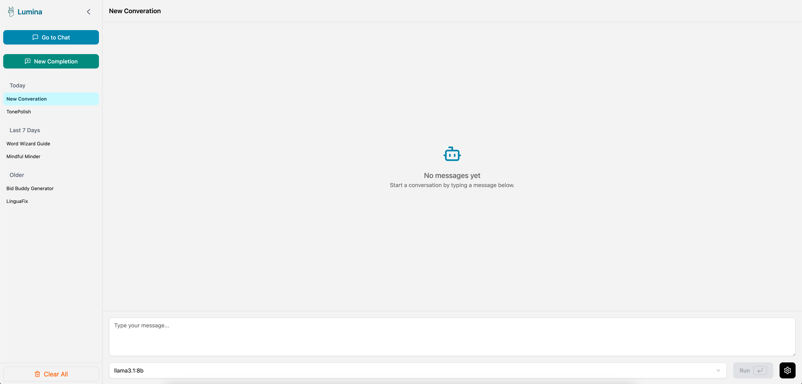
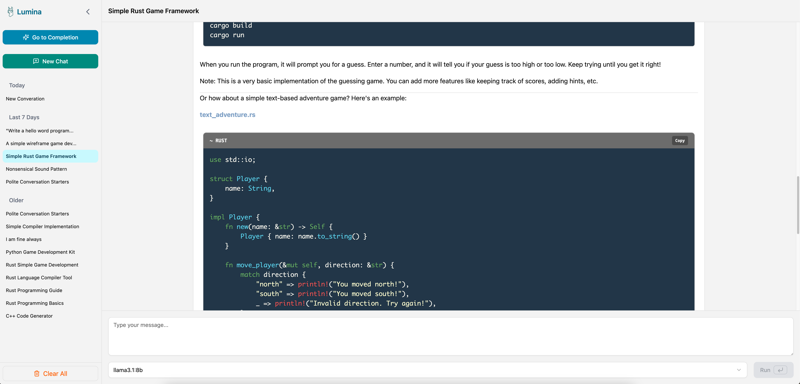

#  Lumina (Ollama Web Client) 
<p align="center">
  <a href="https://github.com/your-username/ollama-web-client/blob/main/LICENSE">
    
  </a>
  
  
  <a href="https://github.com/ollama/ollama">
    
  </a>
</p>
<p align="center">
A lightweight, minimalistic frontend built with React.js for interacting with the Ollama API.
Designed with minimal dependencies for simplicity, speed, and easy customization.
</p>

## 🚀 Features

- Minimal dependecies - build with React only
- Streamed conversation with Ollama models
- Persistant Converstaion with models
- Markdown rendering with syntax highlighting
- Support Two modes Chat and Completion
- Copy code blocks or entire messsage
- Auto Title Genreation for Conversations
- Exlusive Reasoning Component
- Clean, Reponsive UI
- Easy to customize and extend
- Local-first - no external services needed

## 📸 Screenshot




## 🛠️ Tech Stack

- React.js
- Tailwindcss
- shadcn/ui

## 📦 Getting Started

Clone the repository and install dependecies:
```bash
git clone https://github.com/cushydigit/lumina.git
cd lumina
npm install
npm run dev
```
or easier way to use [lumina](https://github.com/cushydigit/lumina) with docker
build docker image
```bash
docker build -t lumina .
```
run lumina image on container
```bashe
docker run =p 4173:4173 lumina
```

Make sure your Ollama server is running locally (localhost:11434) or update the API URL if needed.

## ⚙️ Configuration

if your Ollama instance is runnig elsewhere, you could easily edit the API_BASE_URL in ...

## 📄 License

This porject is licensed under the MIT License.

## 🙌 Contributing

pull requiest, suggestions, and feedback are welcome!


## 🔗 Related Links

- [Ollama Official Website](https://ollama.com/)
- [Ollama Official Repository](https://github.com/ollama/ollama)
- [Ollama Developement Documention](https://github.com/ollama/ollama/blob/main/docs/development.md)


